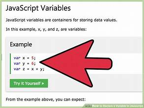
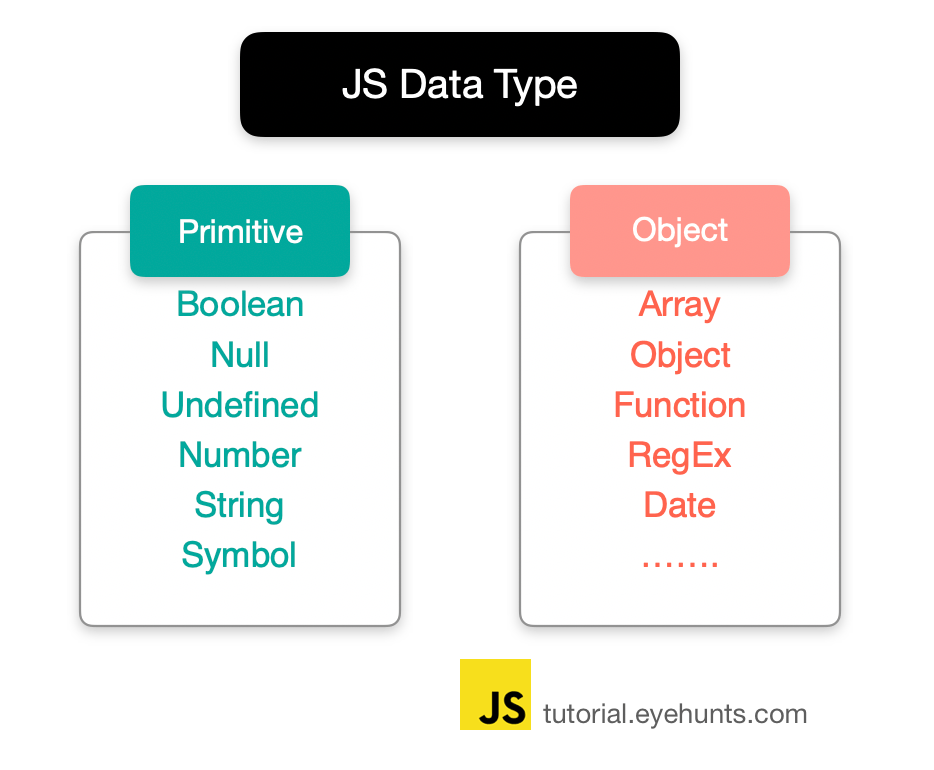
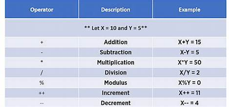
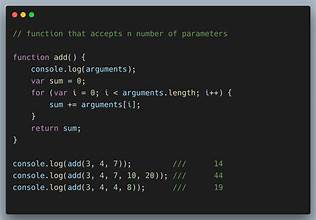
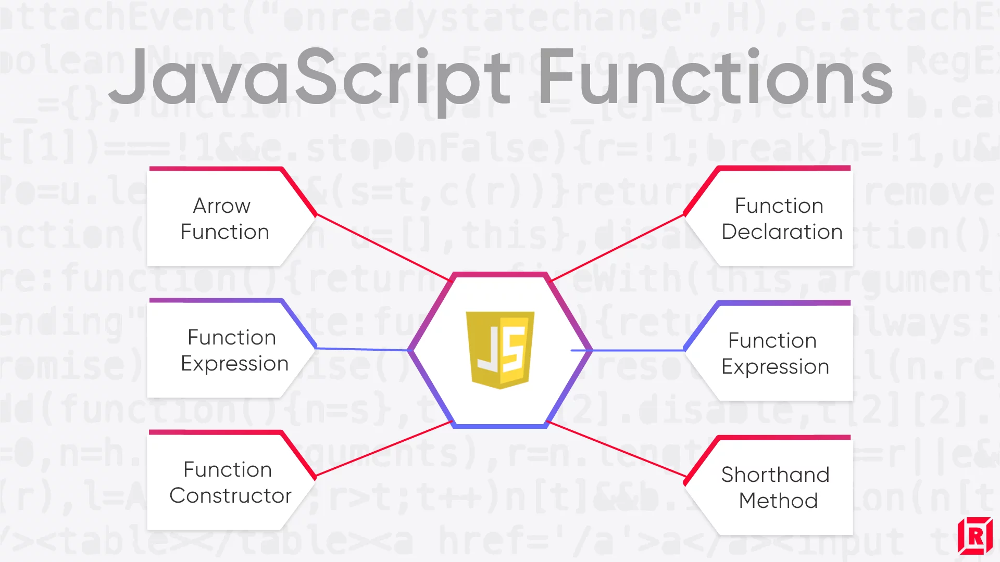

### Javascript story

#####  JavaScript, often abbreviated as JS, is a programming language that is one of the core technologies of the World Wide Web, alongside HTML and CSS. As of 2023, 98.7% of websites use JavaScript on the client side for webpage behavior,[10] often incorporating third-party libraries. All major web browsers have a dedicated JavaScript engine to execute the code on users' devices.
### BRENDAN EACH
 
#####  Brendan Eich (/ˈaɪk/; born July 4, 1961)[1] is an American computer programmer and technology executive. He created the JavaScript programming language and co-founded the Mozilla project, the Mozilla Foundation, and the Mozilla Corporation. He served as the Mozilla Corporation's chief technical officer before he was appointed chief executive officer, but resigned shortly after his appointment due to pressure over his firm opposition to same-sex marriage. He subsequently became the CEO of Brave Software.
### Variable in JS

 ##### After reading the last couple of articles you should now know what JavaScript is, what it can do for you, how you use it alongside other web technologies, and what its main features look like from a high level. In this article, we will get down to the real basics, looking at how to work with the most basic building blocks of JavaScript — Variables.
 ### DATA TYPE
 
 #####  Data types and type checking are fundamental aspects of any programming language.
 ### Operators IN JavaScript
 
 ##### An operator is capable of manipulating a certain value or operand. Operators are used to performing specific mathematical and logical computations on operands. In other words, we can say that an operator operates the operands. In JavaScript, operators are used for comparing values, performing arithmetic operations, etc.
 ### Function in JS
 
 ##### Answered Oct 12, 2015 · 6 votes
##### The functions are out of scope of one another. You can see this by looking at this block:

##### $(document).readyfunction()
  #####  function loadFYfResults(sizes)
  ### types of function in JS
  
  ##### Functions are one of the fundamental building blocks in JavaScript. A function in JavaScript is similar to a procedure—a set of statements that performs a task or calculates a value, but for a procedure to qualify as a function, it should take some input and return an output where there is some obvious relationship between the input and the output. To use a function, you must define it somewhere in the scope from which you wish to call it.